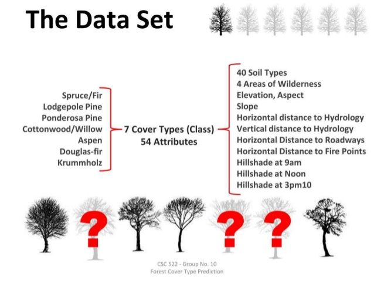

# Machine Learning Engineering Nanodegree
# Project: Forest Cover Type
## Supervised Learning (Classification)

<p align = 'center'></p>

----

### Table Of Contents:
- [Description](#description)<br>
    - [About the project](#about-the-project)<br>
    - [What needs to be done](#what-needs-to-be-done)<br>
    - [Why this project](#why-this-project)<br>
- [Data](#data)<br>
    - [Files](#files)<br>
    - [Dataset file](#dataset-file)<br>
- [Loading Project](#loading-project)<br>
    - [Requirements](#requirements)<br>
    - [Execution](#execution)<br>
- [Conclusion](#conclusion)<br>
    - [What I learned](#what-i-learned)<br>
    - [Evaluation](#evaluation)
    - [Results](#results)

----

### Description

#### About the project
This study area includes 4 Wilderness Areas located in the Roosevelt National Forest of Northern Colorado. These area represent forests with minimal human-caused disturbances, so that existing forest cover types are more a result of ecological process rather than forest management practices.

Each observation is 30m x 30m forest cover type determined from US Forest Service (USFS) Region 2 Resource Information System (RIS) data. Independent variables were derived from the data originally obtained from US Geological Survey (USGS) and USFS data.


#### What needs to be done
We have been given a total of 54 attributes/features, these attributes contain Binary and Quantative attributes, and we need to predict which Forest Cover-Type is it from the given features.


#### Why this project
Given elevation, hydrologic, soil, and sunlight data can we predict what type of tree would be in a small patch of forest? This project attempts to predict the predominant type of tree in sections of wooded area. Understanding forest composition is a valuable aspect of managing the health and vitality of our wilderness areas. Classifying cover type can help further research regarding forest fire susceptibility and de/reforestation concerns. Forest cover type data is often collected by hand or computed using remote sensing techniques, e.g. satellite imagery. Such processes are both time and resource intensive. In this project, we aim to predict forest cover type using cartographic data and a variety of classification algorithms.


----

### Data

#### Files

This project contains 3 files and 1 folder:

- `result.ipynb`: This is the main file where I have performed my work on the project.
- `covtype.data`: The forest cover-type dataset. I have loaded this data in the notebook..
- `proposal.pdf` : My detailed explaination of the project.
- `export/` : Folder containing HTML and PDF version file of notebook.


#### Dataset file
This part has been reviewed throughly in `proposal.pdf` file. [Visit](https://github.com/JuzerShakir/Forest_Cover-Type/blob/master/proposal.pdf)

----

### Loading Project

#### Requirements

This project requires **Python 3.6** and the following Python libraries installed:

- [Python 3.6.6](https://www.python.org/downloads/release/python-366/)      (Language Used for the project)
- [NumPy](http://www.numpy.org/)                                            (For Scientific Computing)
- [Pandas](http://pandas.pydata.org)                                        (For Data Analysis)
- [matplotlib](http://matplotlib.org/)                                      (For Visualization)   
- [seaborn](https://seaborn.pydata.org/installing.html)                     (For Visualization)
- [scikit-learn](http://scikit-learn.org/stable/)                           (ML Library for Python)

You will also need to have software installed to run and execute a [Jupyter Notebook](http://jupyter.org/install)

If you do not have Python installed yet, it is highly recommended that you install the [Anaconda](https://www.anaconda.com/download/) distribution of Python, which already has the above packages and more included.

#### Execution

In a terminal or command window, navigate to the top-level project directory `Forest_Cover-Type` (that contains this README) and run one of the following commands:

```bash
ipython notebook result.ipynb
```  
or
```bash
jupyter notebook result.ipynb
```

This will open the Jupyter/iPython Notebook software and project file in your browser.

-----

### Conclusion

#### What I learned
- How to research and investigate a real-world problem of interest.
- How to accurately apply specific machine learning algorithms and techniques.
- How to properly analyze and visualize your data and results for validity.
- How to document and write a report of your work.

#### Evaluation
My proposal was reviewed by a Udacity reviewer against the **<a href="https://review.udacity.com/#!/rubrics/410/view" target="_blank">Capstone Proposal rubric</a>**. All criteria found in the rubric must be *meeting specifications* for me to pass.

#### Results
[My Proposal Review by an Udacity Reviewer](https://review.udacity.com/#!/reviews/1419617)

----